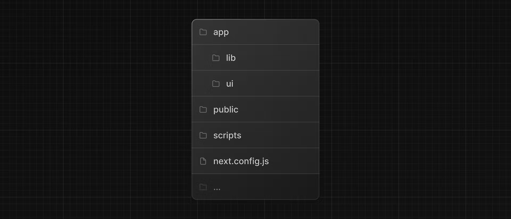

# Folder structure :

/app: Contains all the routes, components, and logic for your application, this is where you'll be mostly working from.

/app/lib: Contains functions used in your application, such as reusable utility functions and data fetching functions.

/app/ui: Contains all the UI components for your application, such as cards, tables, and forms.

/public: Contains all the static assets for your application, such as images.

/scripts: Contains a seeding script that you'll use to populate your database in a later chapter.

Config Files: You'll also notice config files such as ```next.config.js``` at the root of your application. Most of these files are created and pre-configured when you start a new project using ```create-next-app```. 
# Cấu trúc thư mục :
/app: Bao gồm những routes, components, và logic, đây là thư mục bạn sẽ làm việc nhiều nhất.

/app/lib: Bao gồm những hàm chức năng được sử dụng trong ứng dụng của bạn, ví dụ như một hàm utils (tiện ích) có thể tái sử dụng hoặc một hàm fetch (tìm/nạp) dữ liệu

/app/ui: Bao gồm tất cả UI components, ví dụ cards, tables, và forms v.v...

/public: Bao gồm những nội dung tĩnh, như ảnh, font chữ v.v..

/scripts: Bao gồm những Seeding data mà bạn có thể sẽ sử dụng để đẩy nó lên database

Config Files: Bạn cũng sẽ để ý có những file như kiểu ```next.config.js``` . Hầu hết những file này được tạo và đã được cấu hình sẵn khi bạn sử dụng câu lệnh ```create-next-app```

