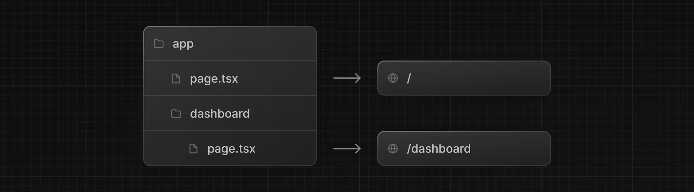

# Nested routing
Next.js uses file-system routing where folders are used to create nested routes. Each folder represents a route segment that maps to a URL segment.

You can create separate UIs for each route using `layout.tsx` and `page.tsx` files.

`page.tsx` is a special `Next.js` file that exports a React component, and it's required for the route to be accessible. In your application, you already have a page file: `/app/page.tsx` - this is the home page associated with the route `/`.

To create a nested route, you can nest folders inside each other and add page.tsx files inside them. For example:

`/app/dashboard/page.tsx` is associated with the `/dashboard` path. Let's create the page to see how it works!