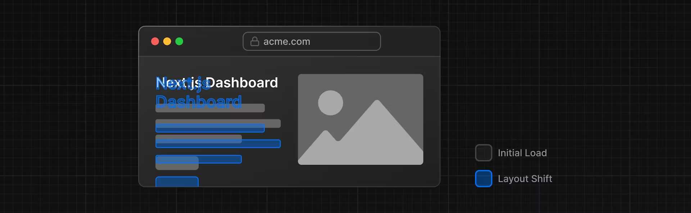
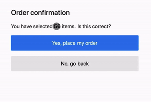
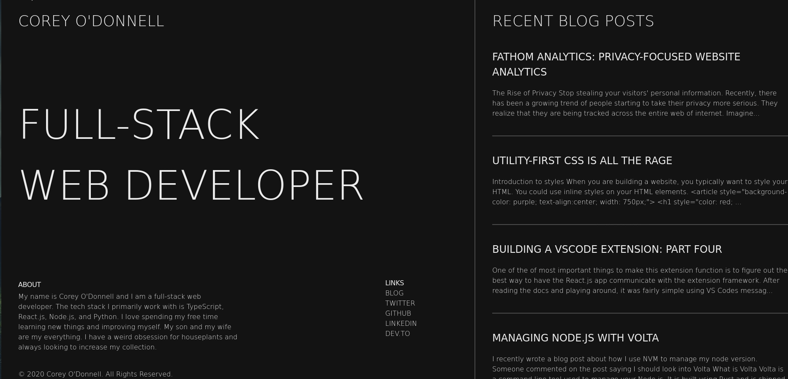

[Docs / Tài liệu](https://nextjs.org/docs/app/building-your-application/optimizing/fonts)

# Why optimize fonts?

Fonts play a significant role in the design of a website, but using custom fonts in your project can affect performance if the font files need to be fetched and loaded.

[Cumulative Layout Shift](https://web.dev/cls/) is a metric used by Google to evaluate the performance and user experience of a website. With fonts, layout shift happens when the browser initially renders text in a fallback or system font and then swaps it out for a custom font once it has loaded. This swap can cause the text size, spacing, or layout to change, shifting elements around it.

  
  

  The sudden change in layout causes users to confirm a large order of their choice.
  

  
  

  
  Loading for the first time will display the system (or fallback) font, then switch to the custom font after loading.
  

Next.js automatically optimizes fonts in the application when you use the `next/font` module. It downloads font files at build time and hosts them with your other static assets. This means when a user visits your application, there are no additional network requests for fonts which would impact performance.

   

# Tại sao phải tối ưu hóa phông chữ ?

Phông chữ đóng một vai trò quan trọng trong thiết kế trang web, nhưng việc sử dụng phông chữ tùy chỉnh trong dự án của bạn có thể ảnh hưởng đến hiệu suất nếu phông chữ cần phải tìm đâu đó trên mạng và tải lên

[Cumulative Layout Shift](https://web.dev/cls/) (Điểm số tổng hợp về mức thay đổi bố cục) là số liệu được Google sử dụng để đánh giá hiệu suất và trải nghiệm người dùng của một trang web. Với phông chữ, sự thay đổi bố cục xảy ra khi trình duyệt ban đầu hiển thị văn bản ở phông chữ dự phòng hoặc phông chữ hệ thống, sau đó hoán đổi nó thành phông chữ tùy chỉnh sau khi được tải. Việc hoán đổi này có thể khiến kích thước văn bản, khoảng cách hoặc bố cục thay đổi, dịch chuyển các phần tử xung quanh nó.

  
  

  Sự thay đổi đột ngột về bố cục khiến người dùng xác nhận một đơn đặt hàng lớn mà họ định huỷ.
  

  
  

  việc load lần đầu hiển thị phông hệ thống (hoặc dự phòng) sau đó hoán đổi thành phông tùy chỉnh sau khi được tải.
  

Next.js sẽ tự động tối ưu hóa phông chữ trong ứng dụng khi bạn sử dụng `next/font` mô-đun. Nó tải xuống các tệp phông chữ tại thời điểm xây dựng và lưu trữ chúng cùng với các nội dung tĩnh khác của bạn trước khi ứng dụng của bạn được khởi chạy. Điều này có nghĩa là khi người dùng truy cập ứng dụng của bạn, không có yêu cầu mạng bổ sung nào về phông chữ có thể ảnh hưởng đến hiệu suất